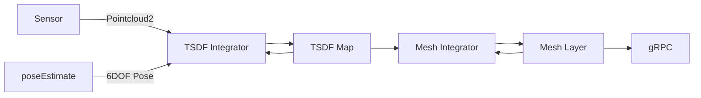

go-voxblox
---

A Go implementation of [Voxblox](https://github.com/ethz-asl/voxblox)

Voxblox system diagram

go-voxblox system diagram

## TODO

* Mesh generation
* Remove distant blocks
* Integrators
    * Merged
    * Fast
* ROS integration
* gRPC mesh server
* Logging
* System tests
* ICP?
* Linear indexing on voxels?
* CUDA?

## References

* [CHISEL](http://www.roboticsproceedings.org/rss11/p40.pdf)

