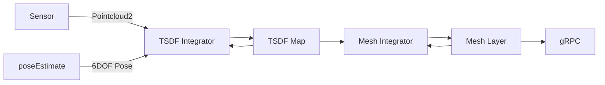

go-voxblox
---
[](https://github.com/swarmt/go-voxblox/actions/workflows/go.yml)
---

A Go implementation of [Voxblox](https://github.com/ethz-asl/voxblox)

go-voxblox system diagram



## Performance

[Cow and Lady Dataset](https://projects.asl.ethz.ch/datasets/doku.php?id=iros2017/)

Note: This needs to be decompressed to run real time with ```rosbag decompress```


## Generate protobuf and gRPC files
```bash
protoc --go_out=. --go_opt=paths=source_relative \
--go-grpc_out=. --go-grpc_opt=paths=source_relative \
proto/mesh_service.proto 
```

## TODO

* Merged integrator weights and speed
* Better / more unit tests
* Cache distant blocks with protobuf
* ROS integration
* gRPC mesh server
* Logging
* System tests
* Stress test / map size
* ICP?
* Linear indexing on voxels?
* CUDA?

## References

* [CHISEL](http://www.roboticsproceedings.org/rss11/p40.pdf)

