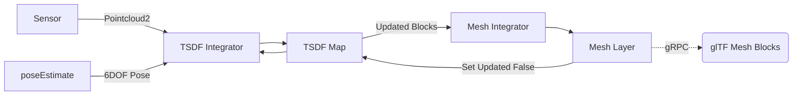

go-voxblox [](https://github.com/swarmt/go-voxblox/actions/workflows/go.yml)
---

A Go port(ish) of [Voxblox](https://github.com/ethz-asl/voxblox) modified to use sparse leaves and transmit mesh updates
over gRPC as glTF (glb).

I wrote this to learn golang so some or all of it might make your eyes bleed.

## System Diagram



## Test

```bash
go test go-voxblox
```

## Run

Download the [Cow and Lady Dataset](https://projects.asl.ethz.ch/datasets/doku.php?id=iros2017/) and decompress 
(required for real time playback) with: 
```bash
rosbag decompress data.bag
```

Settings are configured in ```voxblox.yaml```. 

The `simple`, `merged` and `fast` integrators are available however the code runs the `fast` integrator by default.

Start a roscore with:
```bash
roscore
```

Start the node with:
```bash
go build go-voxblox
```

Start the bag playback with:
```bash
rosbag play --clock data.bag
```

You should logs similar to the following:
```
2023/12/12 20:58:34 Convert PointCloud2: 2.312166ms
2023/12/12 20:58:34 Integrate Fast: 6.760125ms
2023/12/12 20:58:34 Convert PointCloud2: 3.882959ms
2023/12/12 20:58:34 Integrate Fast: 13.282292ms
```


## Generate gRPC files

If you need to regenerate the protobuf and gRPC files you can do so with the following command:

```bash
protoc --go_out=. --go_opt=paths=source_relative \
--go-grpc_out=. --go-grpc_opt=paths=source_relative \
proto/mesh_service.proto 
```

## TODO

* Merged integrator weights and speed
* Better / more unit tests
* Cache distant blocks with protobuf
* Logging
* System tests
* Stress test / map size
* ICP (kiss-icp?)
* Block updated status per subscriber

## References

* [CHISEL](http://www.roboticsproceedings.org/rss11/p40.pdf)

