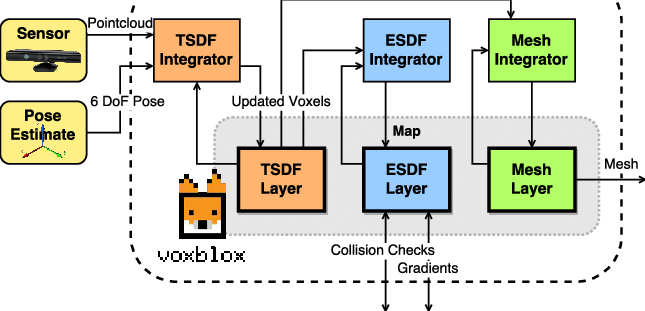
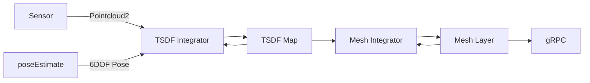
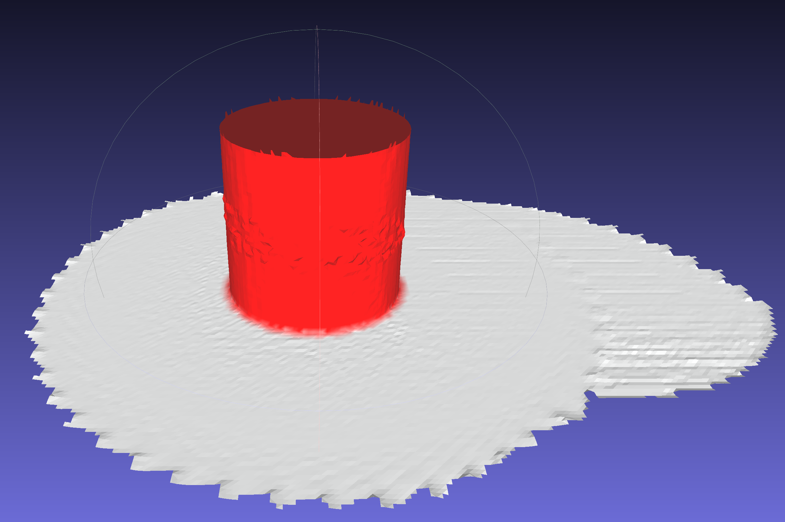

go-voxblox
---

A Go implementation of [Voxblox](https://github.com/ethz-asl/voxblox)

Voxblox system diagram



go-voxblox system diagram





[Cow and Lady Dataset](https://projects.asl.ethz.ch/datasets/doku.php?id=iros2017/)

Note: This needs to be decompressed to run real time with ```rosbag decompress```


## TODO

* Merge duplicate vertices
* Better unit tests
* Remove distant blocks
* ROS integration
* gRPC mesh server
* Logging
* System tests
* ICP?
* Linear indexing on voxels?
* CUDA?

## References

* [CHISEL](http://www.roboticsproceedings.org/rss11/p40.pdf)

